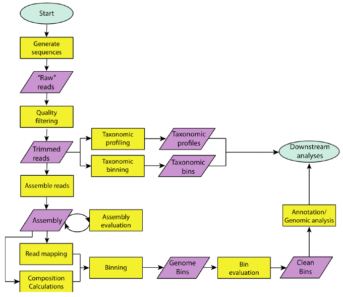
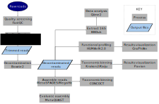

# PhagePipe
Pipeline for metagenomics of rhizosphere and associated phages.

## Pre-processing of reads
- FastQC
- Trimmomatic
- Bowtie2

## Genome assembly
- MetaSPADES
- MegaHit

### Evaluation of assembly
- MetaQUAST

## Metagenomics analysis Flowchart

## Pipeline

